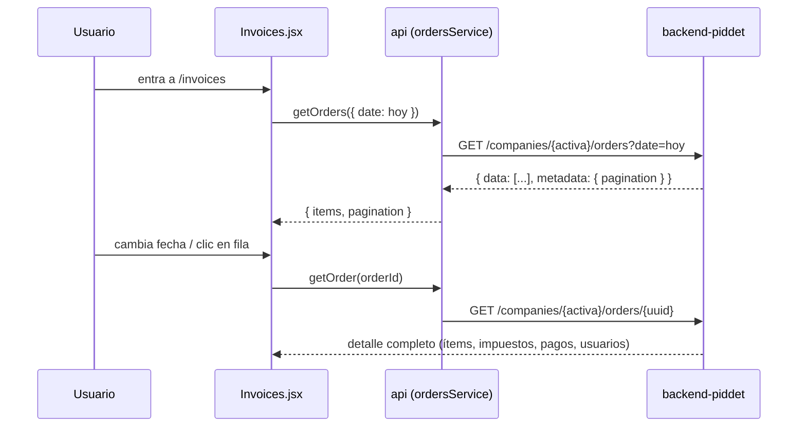

# [FEATURE-1] Facturas por fecha (módulo Facturas)

> **Tipo:** feature
> **Estado:** done
> **Creado:** 2026-07-01

---

## Especificación Funcional

### Descripción

Nuevo módulo **Facturas** en el administrador para consultar las órdenes/facturas realizadas
por la compañía activa en una fecha dada. Por defecto se muestra la fecha de hoy y el usuario
puede seleccionar otra fecha (un solo día). Al hacer clic en una factura se abre su detalle
completo: ítems con sus opciones, impuestos aplicados, pagos, totales, estado, y los usuarios
involucrados (cliente que la solicitó y usuario que la creó).

Hoy el backend solo expone la **creación** de órdenes (`POST /orders`); no existe ningún
endpoint de listado ni de detalle. Esta feature abarca **ambos repos**:

- **backend-piddet (Laravel):** endpoints de listado por fecha y detalle, con permiso nuevo.
- **piddet-administrator (SPA):** servicio, pantallas de listado y detalle, permiso y menú.

### Contexto

- **Backend:** dominio Orders ya modelado en `app/Models/Orders/` (conexión `orders`, BD
  `piddet_orders`): `Order`, `OrderItem`, `OrderItemOption`, `OrderTax`, `OrderUser`
  (tipos `OWNER` = cliente, `CREATOR` = mesero/vendedor), `OrderPayment`, `Status`.
  `OrdersRepositoryImp::getOrderDetail()` ya arma el detalle completo (orden, cliente,
  ítems con opciones, impuestos agrupados, estado, pagos).
- **Frontend:** nuevo módulo de solo lectura, scopeado a la compañía activa, siguiendo el
  patrón de pantallas existente (`useResource` + `Card` + `DataTable` + `FilterBar`) y el
  gateo por permisos (`modules.js` + `RequirePermission`).

### Casos de uso

1. Como administrador de la compañía, quiero ver el listado de facturas del día de hoy al
   entrar al módulo, para revisar la operación del día sin configurar nada.
2. Como administrador, quiero seleccionar otra fecha para consultar las facturas de ese día.
3. Como administrador, quiero abrir una factura y ver todo su detalle (ítems, opciones,
   impuestos, pagos, totales, estado, cliente y quién la creó) para poder evidenciar y
   auditar la información.
4. Como administrador sin el permiso `api-module-orders`, no veo el módulo en el menú y su
   ruta me redirige a Inicio.

### Criterios de aceptación

- [ ] El menú lateral muestra "Facturas" solo si el usuario tiene `api-module-orders` en la
      compañía activa; la ruta `/invoices` está envuelta en `RequirePermission`.
- [ ] Al entrar a `/invoices` se listan las órdenes de **hoy** de la compañía activa.
- [ ] Un selector de fecha (un solo día) permite cambiar el día consultado y recarga el listado.
- [ ] El listado muestra **todas** las órdenes del día (pagadas, sin pago y canceladas) con
      su número, hora, origen, tipo de servicio, estado, estado de pago y total.
- [ ] Al hacer clic en una fila se navega a `/invoices/:orderId` con el detalle completo:
      ítems (con opciones/toppings), impuestos (porcentaje y valor), pagos (método y valor),
      subtotal/impuesto/descuento/total, estado, cliente (OWNER) y creador (CREATOR).
- [ ] Cambiar la compañía activa recarga el listado para la nueva compañía.
- [ ] En modo demo (`VITE_API_URL` vacío) el módulo funciona con datos de `mock.js`.
- [ ] Backend: `GET /companies/{company}/orders?date=YYYY-MM-DD` devuelve el listado paginado
      del día, scopeado por compañía y protegido con `permission.api:api-module-orders`.
- [ ] Backend: `GET /companies/{company}/orders/{uuid}` devuelve el detalle completo y valida
      que la orden pertenezca a la compañía de la ruta (404 si no).

---

## Especificación Técnica

### Backend (backend-piddet)

#### Archivos a modificar

| Archivo | Cambio |
|---|---|
| `routes/api/v1.php` | Añadir bajo el grupo `companies/{company}` + namespace `Orders`: `GET /orders` y `GET /orders/{uuid}` con `jwt.auth` + `permission.api:api-module-orders`. |
| `app/Http/Constants/OrderPermissionsConstants.php` | Nueva constante `PERMISSION_ORDER_MODULE = 'api-module-orders'`. |
| `app/Http/Controllers/Modules/Api/Orders/OrdersController.php` | Nuevos métodos `index` (listado por fecha, paginado) y `show` (detalle por uuid). |
| `app/Services/Orders/OrderService.php` (+ `Imp/OrderServiceImp.php`) | Métodos `getOrdersByCompanyAndDate(int $companyId, string $date, ...)` y `getOrderDetailForCompany(int $companyId, string $uuid)`. |
| `app/Repositories/Orders/OrdersRepository.php` (+ `Imp/OrdersRepositoryImp.php`) | Método de listado paginado por `company_id` + scope `date()` (orden descendente por `created_at`); reutilizar `getOrderDetail()` para el detalle validando `company_id`. |
| Seeder/registro de permisos (donde se registran los `api-module-*` existentes) | Registrar `api-module-orders` para poder asignarlo a roles. |

#### Nuevos archivos

- `app/Http/Resources/Orders/OrderListResource.php` — serializa la fila del listado
  (uuid, order_number, created_at, origin, service_type, status, status_payment, totales,
  nombre del cliente OWNER si existe).
- `app/Http/Resources/Orders/OrderDetailResource.php` — serializa la estructura de
  `getOrderDetail()` (order, customer, creator, items con opciones, taxes, payments, status).

#### Cambios en base de datos

Ninguno. Se usan las tablas existentes de `piddet_orders` (índices por `company_id` y
`order_id` ya presentes). Solo se registra el permiso `api-module-orders` (datos, no schema).

#### Contrato API (borrador)

```
GET /api/v1/companies/{company}/orders?date=2026-07-01&page=1
→ { status, message, data: [ {
      id, order_number, created_at, origin, service_type,
      status, status_payment, subtotal, tax, discount, total,
      customer_name
  } ], metadata: { pagination } }

GET /api/v1/companies/{company}/orders/{uuid}
→ { status, message, data: {
      order: { id, order_number, created_at, date, origin, service_type,
               status, status_payment, status_logistic, table_id,
               subtotal, tax, discount, total },
      customer: { first_name, last_name, email, phone_code, phone_number },
      creator:  { first_name, last_name, email },
      items: [ { name, reference, quantity, value, subtotal, tax, discount, total,
                 options: [ { name, value, quantity, total } ] } ],
      taxes: [ { tax_id, percentage, value } ],
      payments: [ { payment_method, value } ]
  } }
```

`date` opcional: si no llega, el backend usa la fecha actual. El filtro usa el scope
`Order::date()` existente (rango `created_at` 00:00:00–23:59:59 del día).

### Frontend (piddet-administrator)

#### Archivos a modificar

| Archivo | Cambio |
|---|---|
| `src/lib/api.js` | Componer el nuevo `ordersService` en el barril. |
| `src/lib/permissions/modules.js` | Declarar el módulo `invoices` → permiso `api-module-orders`. |
| `src/App.jsx` | Rutas `/invoices` y `/invoices/:orderId` envueltas en `RequirePermission`. |
| Sidebar (menú) | Entrada "Facturas" (icono FontAwesome, p. ej. `fa-file-invoice`), visible según permiso. |
| `src/data/mock.js` | Datos de ejemplo para listado y detalle de órdenes (modo demo). |

#### Nuevos archivos

- `src/lib/services/orders.js` — `getOrders({ companyId, date, page })` y
  `getOrder(companyId, orderId)` sobre los endpoints anteriores (`paginated: true` en el listado).
- `src/screens/Invoices.jsx` + `Invoices.module.css` — listado: selector de fecha (default
  hoy) + `DataTable` dentro de `Card`, fila clickeable → navega al detalle.
- `src/screens/InvoiceDetail.jsx` + `InvoiceDetail.module.css` — detalle completo de la factura.

#### Bosquejo de UI (borrador, ajustable)

Listado `/invoices`:

```
┌──────────────────────────────────────────────────────────────┐
│ Facturas                                                     │
│ ┌──────────────┐                                             │
│ │ 📅 01/07/2026 │   (selector de fecha, default hoy)         │
│ └──────────────┘                                             │
│ ┌──────────────────────────────────────────────────────────┐ │
│ │ Nº      Hora   Cliente        Origen  Estado    Pago  Total│ │
│ │ #0012   13:45  Juan Pérez     POS     Creada    Pagada $45k│ │
│ │ #0011   13:20  —              WAITER  Aceptada  Sin pago…  │ │
│ │ #0010   12:58  Ana Gómez      POS     Cancelada Sin pago…  │ │
│ └──────────────────────────────────────────────────────────┘ │
│                     « 1 2 3 »  (paginación)                  │
└──────────────────────────────────────────────────────────────┘
```

Detalle `/invoices/:orderId`:

```
┌──────────────────────────────────────────────────────────────┐
│ ← Facturas   Factura #0012 · 01/07/2026 13:45   [Pagada]     │
│ ┌──── Ítems ─────────────────────────┐ ┌── Resumen ────────┐ │
│ │ 2× Hamburguesa clásica      $30.000│ │ Subtotal   $37.815│ │
│ │    + Queso extra             $2.000│ │ Impuestos   $7.185│ │
│ │ 1× Limonada                  $8.000│ │ Descuento       $0│ │
│ │                                    │ │ Total      $45.000│ │
│ └────────────────────────────────────┘ └───────────────────┘ │
│ ┌── Impuestos ──────────┐ ┌── Pagos ──────────────────────┐  │
│ │ IVA 19%        $7.185 │ │ Efectivo              $45.000 │  │
│ └───────────────────────┘ └───────────────────────────────┘  │
│ ┌── Cliente (solicitó) ─────┐ ┌── Creada por ─────────────┐  │
│ │ Juan Pérez · +57 300 …    │ │ María Ruiz (mesera)       │  │
│ └───────────────────────────┘ └───────────────────────────┘  │
│  Origen: POS · Servicio: DINE_IN · Mesa: 4                   │
└──────────────────────────────────────────────────────────────┘
```

#### Flujo de datos



### Consideraciones técnicas

- **Solo lectura:** el módulo no crea ni modifica órdenes; no hay mutaciones optimistas.
- **Scoping por compañía:** el listado y el detalle validan `company_id` contra el `{company}`
  de la ruta (detalle inexistente o de otra compañía → 404). En el frontend, todo consulta la
  compañía activa; el cambio de compañía recarga vía el flujo existente.
- **"Factura" = Order:** no existe un modelo Invoice/Document ligado a Order; la factura es la
  orden con su detalle. Si más adelante hay facturación electrónica, será otro spec.
- **Fecha:** un solo día, filtrado por `created_at` con el scope `Order::date()` existente.
  El frontend envía `YYYY-MM-DD`; sin parámetro, el backend asume hoy.
- **Estados visibles:** se muestran todos los estados con `Badge` (mapeo estado → color con
  tokens); las canceladas se distinguen visualmente pero no se ocultan.
- **Permiso:** whitelist estricta con `api-module-orders`, siguiendo la convención
  `api-module-*` (declararlo en `modules.js` y documentarlo en `CLAUDE.md`/guía de permisos
  al implementar).
- **Formato de dinero/fecha:** reutilizar los formatos ya usados por Dashboard/pedidos
  recientes para mantener consistencia.

### Dependencias

- **backend-piddet** (repo `~/www/backend-piddet`): los endpoints deben existir antes de
  conectar el frontend en modo real; mientras tanto el módulo funciona en modo demo (mock).
- Asignación del permiso `api-module-orders` a los roles correspondientes (dato en BD).
- Ningún spec previo requerido.
