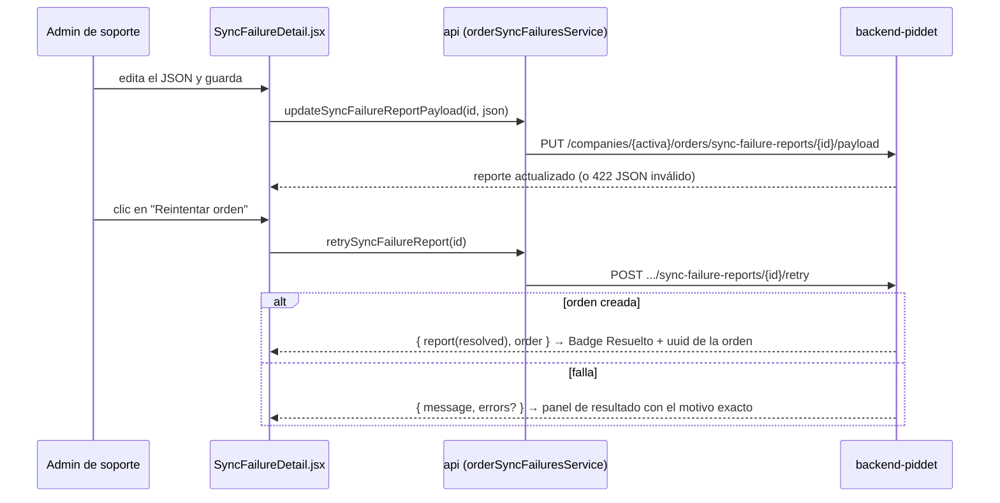

# [FEATURE-2] Fallos de sincronización de órdenes (módulo de soporte)

> **Tipo:** feature
> **Estado:** done
> **Creado:** 2026-07-02
> **Spec espejo (backend):** backend-piddet `specs/feature/0002-order-sync-failure-reports-admin`

---

## Especificación Funcional

### Descripción

Nuevo módulo de soporte, dentro del grupo **Configuraciones**, para administrar los
**reportes de fallo de sincronización de órdenes**: cuando el POS no logra crear una orden,
reporta la evidencia (JSON completo de la orden + error) y queda registrada en el backend.
Este módulo permite a un administrador con el permiso nuevo `order-sync-failure-admin`:

- **Listar** los fallos de la compañía activa, filtrando por estado de soporte.
- **Ver el detalle** de un fallo: error reportado, contexto, intentos, quién lo reportó y el
  **JSON completo de la orden**.
- **Editar el JSON** de la orden (corregir el dato que impide crearla) y guardarlo.
- **Reintentar la creación de la orden** con el payload guardado: si se crea, el reporte
  pasa automáticamente a **Resuelto**; si falla, se muestra el **motivo exacto** devuelto
  por el backend (mensaje del paso fallido o errores de validación campo a campo).
- **Cambiar el estado de soporte** manualmente: marcar **No recuperable**, reabrir a
  **Pendiente**, o cerrar como **Resuelto** con una nota (p. ej. la orden se re-digitó a mano).

Estados de soporte: `pending` (Pendiente, estado inicial) → `resolved` (Resuelto) /
`unrecoverable` (No recuperable). `resolved` es terminal.

### Contexto

- **Backend:** el spec espejo expone el contrato bajo
  `companies/{company}/orders/sync-failure-reports` (listado, detalle, payload, estado,
  retry), todo gateado por `permission.api:order-sync-failure-admin`. El scoping matchea
  `company_id` **o** `company_username`, así los reportes huérfanos (falla típica:
  `company_id` ausente) sí aparecen si el username es válido.
- **Frontend:** módulo scopeado a la compañía activa, siguiendo el patrón existente
  (`useResource` + `Card` + `DataTable` + `FilterBar`, servicio por dominio + barril `api`,
  gateo con `modules.js` + `RequirePermission`). Referencia de estructura: módulo Facturas
  (`Invoices.jsx` / `InvoiceDetail.jsx`, spec `1-invoices-by-date`).

### Casos de uso

1. Como administrador de soporte, quiero ver los fallos pendientes de la compañía activa al
   entrar al módulo, para atenderlos.
2. Como administrador de soporte, quiero abrir un fallo y ver el error y el JSON completo de
   la orden, para diagnosticar por qué no se creó.
3. Como administrador de soporte, quiero editar el JSON y guardarlo, para corregir el dato
   inválido (p. ej. `company_id` ausente).
4. Como administrador de soporte, quiero reintentar la orden y, si falla, ver el motivo
   exacto para seguir iterando; si se crea, ver el reporte resuelto con la referencia de la
   orden creada.
5. Como administrador de soporte, quiero marcar un fallo como No recuperable (o reabrirlo, o
   cerrarlo manualmente con una nota) cuando no proceda recuperarlo.
6. Como usuario sin `order-sync-failure-admin`, no veo el módulo en el menú y su ruta me
   redirige a Inicio.

### Criterios de aceptación

- [ ] "Fallos de órdenes" aparece dentro de **Configuraciones** en el menú lateral solo con
      el permiso `order-sync-failure-admin`; las rutas `/sync-failures` y
      `/sync-failures/:reportId` están envueltas en `RequirePermission`.
- [ ] El listado muestra fecha, número de orden, origen, error (truncado), intentos, quién
      reportó y el estado con `Badge` (Pendiente / Resuelto / No recuperable), paginado y
      con filtro por estado en `FilterBar`.
- [ ] Clic en una fila navega al detalle `/sync-failures/:reportId`.
- [ ] El detalle muestra los datos del reporte (error completo, contexto, `paid_sync_status`,
      origen, reportado por, intentos, último error de retry) y el `order_payload` en un
      **editor JSON** (texto monoespaciado) con validación de sintaxis antes de guardar.
- [ ] "Guardar JSON" persiste el payload editado (`PUT .../payload`); errores del backend se
      muestran al usuario. El editor y las acciones se deshabilitan si el reporte está
      Resuelto.
- [ ] "Reintentar orden" (`POST .../retry`) muestra el resultado de forma inequívoca:
      éxito → estado pasa a Resuelto y se muestra el uuid/número de la orden creada;
      fallo → se muestra el mensaje del backend y, si hay errores de validación, la lista
      campo a campo.
- [ ] "Marcar no recuperable" (con confirmación) y "Reabrir" transicionan el estado; cerrar
      como Resuelto manualmente permite una nota (`resolution_notes`).
- [ ] Cambiar la compañía activa recarga el listado para la nueva compañía.
- [ ] En modo demo (`VITE_API_URL` vacío) el módulo funciona con datos de `mock.js`,
      incluido un retry simulado (un caso que resuelve y uno que falla con error claro).
- [ ] `CLAUDE.md` y la guía de permisos documentan el permiso nuevo.

---

## Especificación Técnica

### Archivos a modificar

| Archivo | Cambio |
|---|---|
| `src/lib/api.js` | Componer el nuevo `orderSyncFailuresService` en el barril. |
| `src/lib/permissions/modules.js` | En el grupo Configuraciones: `{ to: '/sync-failures', label: 'Fallos de órdenes', icon: 'fas fa-triangle-exclamation', perm: 'order-sync-failure-admin' }`. |
| `src/App.jsx` | Rutas `/sync-failures` y `/sync-failures/:reportId` con `RequirePermission` (el detalle reusa el permiso del listado). |
| `src/data/mock.js` | Datos de ejemplo: reportes en los tres estados + respuestas simuladas de retry (éxito y fallo con errores de validación). |
| `CLAUDE.md` + `specs/guides/permissions.md` | Documentar `order-sync-failure-admin`. |

### Nuevos archivos

- `src/lib/services/orderSyncFailures.js` —
  `getSyncFailureReports({ status, page })` (`paginated: true`),
  `getSyncFailureReport(reportId)`,
  `updateSyncFailureReportPayload(reportId, orderPayload)`,
  `updateSyncFailureReportStatus(reportId, { support_status, resolution_notes })`,
  `retrySyncFailureReport(reportId)`.
- `src/screens/SyncFailures.jsx` + `SyncFailures.module.css` — listado.
- `src/screens/SyncFailureDetail.jsx` + `SyncFailureDetail.module.css` — detalle con editor
  JSON y acciones.

### Cambios en base de datos

Ninguno en este repo. El backend añade `support_status` y campos de resolución/reintento a
`order_sync_failure_reports`, y el permiso `order-sync-failure-admin` (ver spec espejo).

### Bosquejo de UI (borrador, ajustable)

Listado `/sync-failures`:

```
┌────────────────────────────────────────────────────────────────────┐
│ Fallos de órdenes                                                  │
│ [ Estado: ▾ Pendiente ]                        (FilterBar)         │
│ ┌────────────────────────────────────────────────────────────────┐ │
│ │ Fecha         Nº orden  Origen  Error                Int  Estado│ │
│ │ 02/07 13:45   #0012     POS     company_id ausente…   3  🟡 Pend│ │
│ │ 01/07 18:02   #0009     POS     timeout al sincron…   1  🟢 Res │ │
│ │ 30/06 11:10   —         POS     payload corrupto…     5  🔴 NoR │ │
│ └────────────────────────────────────────────────────────────────┘ │
│                        « 1 2 »  (paginación)                       │
└────────────────────────────────────────────────────────────────────┘
```

Detalle `/sync-failures/:reportId`:

```
┌────────────────────────────────────────────────────────────────────┐
│ ← Fallos de órdenes   Reporte #0012 · 02/07/2026 13:45  [Pendiente]│
│ ┌── Diagnóstico ─────────────────────────────────────────────────┐ │
│ │ Error: company_id ausente en el payload                        │ │
│ │ Reportó: maria.pos · Origen: POS · Intentos: 3                 │ │
│ │ Último retry: 02/07 14:10 — "The company_id field is required" │ │
│ └────────────────────────────────────────────────────────────────┘ │
│ ┌── JSON de la orden ────────────────────────────────────────────┐ │
│ │ {                                                              │ │
│ │   "origin": "POS",                                             │ │
│ │   "company_id": null,   ← editable (monoespaciado)             │ │
│ │   "items": [ ... ]                                             │ │
│ │ }                                                              │ │
│ └────────────────────────────────────────────────────────────────┘ │
│ [Guardar JSON]  [▶ Reintentar orden]  [Marcar no recuperable]      │
│ ┌── Resultado del reintento ─────────────────────────────────────┐ │
│ │ ✖ Validación: company_id: requerido · payment.status: inválido │ │
│ └────────────────────────────────────────────────────────────────┘ │
└────────────────────────────────────────────────────────────────────┘
```

### Flujo de datos (retry)



### Consideraciones técnicas

- **Editor JSON:** textarea monoespaciada (tokens de fuente existentes) con
  `JSON.parse` de validación al guardar y formateo (`JSON.stringify(_, null, 2)`) al cargar.
  Sin librerías nuevas de editor; si se necesita resaltado, será otro spec.
- **Errores del retry:** el backend devuelve el paso fallido con mensaje claro (contrato en
  el spec espejo); el detalle los renderiza sin reinterpretarlos. Los errores de validación
  (`errors: { campo: [...] }`) se listan campo a campo.
- **Estados:** mapa clave → etiqueta/color en español (`pending` → Pendiente/amarillo,
  `resolved` → Resuelto/verde, `unrecoverable` → No recuperable/rojo) con `Badge` y tokens.
  `resolved` es terminal: deshabilita edición, retry y cambios de estado.
- **Mutaciones:** tras guardar/retry/cambio de estado se actualiza el estado local con la
  respuesta (o `reload` del recurso); sin estado global.
- **Identidad del retry:** la orden se crea con el user/creator **del payload** (no el admin);
  el admin solo queda como quien resolvió el reporte. Es responsabilidad del backend.
- **Huérfanos:** el listado puede traer reportes con `company_id` null (matcheados por
  `company_username`); la UI no asume `company_id` presente.

### Dependencias

- **backend-piddet** `specs/feature/0002-order-sync-failure-reports-admin`: endpoints,
  migración de `support_status` y permiso `order-sync-failure-admin` deben existir para el
  modo real; mientras tanto el módulo funciona en modo demo (mock).
- Asignación del permiso a los roles de soporte (dato en BD).
