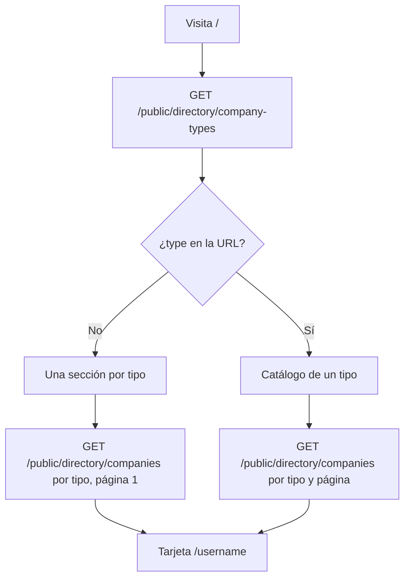

# [FEATURE-3] Directorio público de compañías

> **Tipo:** feature
> **Estado:** done
> **Creado:** 2026-09-19

## Especificación funcional

### Descripción

La raíz pública `/` deja de redirigir al panel administrativo y presenta una portada
mobile-first donde cualquier visitante puede descubrir las compañías activas de Piddet. La
vista normal agrupa una primera página de compañías por tipo; `/?type=<key>` abre el catálogo
paginado de un tipo concreto. Cada tarjeta lleva a la portada existente `/{username}`.

El panel bajo `/admin`, el pre-check-in, los enlaces públicos de hospedaje, las cartas y las
portadas de compañía existentes conservan sus rutas y comportamiento.

### Casos de uso

1. Como visitante, quiero conocer los tipos de negocios disponibles y ver ejemplos de cada uno.
2. Como visitante, quiero abrir todas las compañías de un tipo y recorrer sus páginas.
3. Como visitante, quiero entrar a la portada pública de una compañía desde su tarjeta.
4. Como posible cliente, quiero contactar a Piddet por WhatsApp para vincular mi negocio.
5. Como administrador, quiero encontrar un acceso discreto al inicio de sesión.

### Contrato de datos

- `GET /public/directory/company-types` → tipos `{ key, name, active_companies_count }`.
- `GET /public/directory/companies?company_type_key=...&page=...&per_page=8` → listado paginado de
  `{ username, name, description, icon, thumbnail_icon, city, company_type_key,
  company_type_name, brand_primary, brand_secondary }`.
- Solo el backend decide qué compañías están activas y son públicas.
- En modo demo ambos endpoints tienen datos realistas para `restaurant`, `gym`, `store` y
  `lodging`.

### Criterios de aceptación

- [x] `/` muestra hero, acceso a `/admin/login`, secciones por tipo y llamada final de contacto.
- [x] Cada sección normal carga la primera página (máximo 8) y ofrece «Ver todos».
- [x] `/?type=<key>` muestra solo el tipo elegido, paginación y una acción para volver a todos.
- [x] Las tarjetas navegan a `/{username}` y muestran identidad, descripción, ciudad y tipo.
- [x] Hay estados claros de carga, error y vacío para tipos y compañías.
- [x] El botón de WhatsApp usa `VITE_CONTACT_WHATSAPP` mediante `screens/public/whatsapp.js` y
      se oculta cuando la variable falta o no contiene un número válido.
- [x] El título y metadata social se gestionan con `shareMeta.js`.
- [x] La UI responde correctamente en 375 px, 768 px y escritorio, usando CSS Modules y tokens.
- [x] `/admin` y las rutas públicas existentes no cambian.

## Especificación técnica

### Archivos

- `src/screens/PublicHome/PublicHome.jsx` y `PublicHome.module.css`: pantalla y piezas locales.
- `src/lib/services/company.js`: `publicCompanyTypes` y `publicCompanies`.
- `src/data/mock.js`: catálogo y resolución paginada de ambos endpoints.
- `src/App.jsx`: resolución explícita de `/` antes del panel y preservación de `/{username}`.
- `.env.example`: documentación de `VITE_CONTACT_WHATSAPP`.
- `specs/functional.md` y `specs/tech.md`: comportamiento y arquitectura pública actualizados.

### Flujo



### Bosquejo de UI

```text
┌──────────────────────────────────────────────────────┐
│ piddet                              Administrar      │
│                                                      │
│ Descubre negocios cerca de ti                        │
│ Restaurantes, gimnasios, tiendas y hospedajes…       │
├──────────────────────────────────────────────────────┤
│ Restaurantes                              Ver todos  │
│ [ logo  Empresa · ciudad ] [ logo  Empresa · ciudad] │
│                                                      │
│ Gimnasios                                 Ver todos  │
│ [ logo  Empresa · ciudad ] [ logo  Empresa · ciudad] │
├──────────────────────────────────────────────────────┤
│ ¿Quieres hacer parte?                  [WhatsApp]     │
└──────────────────────────────────────────────────────┘
```

En móvil las tarjetas forman una sola columna; en tablet pasan a dos y en escritorio a cuatro.
El modo por tipo conserva el mismo encabezado y reemplaza las secciones por un único listado con
paginación.

### Riesgos

- Open Graph generado por JavaScript no es leído por todos los crawlers; la previsualización
  definitiva sigue requiriendo metadata servida desde backend/CDN.
- La portada normal hace una petición por tipo además del catálogo; con cuatro tipos son cinco
  peticiones concurrentes. El backend debe mantener el catálogo acotado o evolucionar a un
  endpoint agregado si crece sustancialmente.
